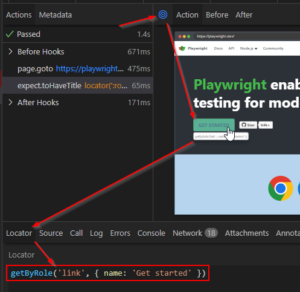

#### PREREQUISITES

1. Node.js
2. Git
3. IDE _(Visual Studio Code or Webstorm or IntelliJ Ultimate)_
4. Playwright plugin for IDE _(**Test Automation for IntelliJ**, Playwright Test for VSCode)_
5. **Playwright CRX** plugin for Chrome browser _(optional)_

---

#### PROJECT CREATION

1. Created folders _C:\UdemyCourses\Playwright_
2. Intellij → New Project from Version Control System → https://github.com/bondar-artem/pw-practice-app.git →   
   _(C:\UdemyCourses\Playwright\pw-practice-app)_
3. IntelliJ → renamed `master` branch to `main`
4. Create empty GitHub repository `pw-practice-app`: https://github.com/Tautvis88/pw-practice-app
   > Steps 4–6 were done using the advice from this link:  
   >> https://stackoverflow.com/questions/18200248/cloning-a-repo-from-someone-elses-github-and-pushing-it-to-a-repo-on-my-github
5. Intellij → Main Menu → Git → Manage Remotes... changed origin URL to my repo: https://github.com/Tautvis88/pw-practice-app
6. Push the main branch to my repo: _right mouse clicks on the main branch and select Push..._

---

#### PLAYWRIGHT INSTALLATION

1. Created `NOTES.md` file and described all performed steps.
2. Run `npm install --force` ('npm install' without --force didn't work - got many npm errors) to install node_modules
3. Run `npm start` to run web application on browser http://localhost:4200/
4. Run `npm init playwright@latest --force` to create playwright framework files. All newly created files added to Git versioning tracking.
5. **_example.spec.ts_** and **_tests-examples/demo-todo-app.spec.ts_** files were not deleted  
   (although during the Udemy Playwright course the lecturer deleted them)

---

### TEST EXECUTION WITH CLI

1. Commented webkit _(Safari)_ browser project in `playwright.config.ts` because I don't have a Safari browser.

| No. | Command                                                  | Description                                                          |
|-----|----------------------------------------------------------|----------------------------------------------------------------------|
| 1.  | `npx playwright test`                                    | to run all tests from **_tests_** folder (no browser UI)             |
| 2.  | `npx playwright test --project=chromium`                 | to run tests only on Chrome browser (**_headless_** - no browser UI) |
| 3.  | `npx playwright test --project=chromium --headed`        | to run tests only on Chrome (**_headed_** - with browser UI)         |
| 4.  | `npx playwright test example.spec.ts --project=chromium` | to run only **_example.spec.ts_** file                               |
| 5.  | `npx playwright test -g "has title" --project=chromium`  | to run a specific test "has title" by the name of the test           |

``` bash
npx playwright test
```

``` bash
npx playwright test --project=chromium
```

``` bash
npx playwright test --project=chromium --headed
```

``` bash
npx playwright test example.spec.ts --project=chromium
```

``` bash
npx playwright test -g "has title" --project=chromium
```

2. To skip a specific test, you need to add `test.skip()`.
3. To run a specific test, you need to add `test.only()`.

---

### TEST EXECUTION WITH UI

1. You can run e2e playwright tests from IntelliJ Ultimate using `Test Automation` plugin.  
   You need to click on a green arrow/triangle next to the test() or test.describe().


2. To run tests using the `Playwright UI runner`, you need to run this command:
``` bash
npx playwright test --ui
```
#### Disadvantages:
For each completed step, `Playwright UI runner` takes a screenshot of your application and displays them in the UI window.  
However, they aren't real pages, so you can't navigate them like you would in a regular browser.

#### Advantages:
You can use `Pick locator` button, click on the element in the screenshot and get locator code, for example: 
`getByRole('link', { name: 'Get started' })`



---

### TRACE VIEW AND DEBUG

You can't run `Playwright UI runner` on the CI server (pipeline). But you can turn on the `tracing mode` using this command:
``` bash
npx playwright test --project=chromium --trace on
```
In the `playwright-report` folder, Playwright will create `trace` folder and `index.html` file.  
Open this `index.html` file on browser, click on the test, then on the `Traces` screenshot, and you will open `Playwright UI runner`.  
By default `trace` is set to `on-first-retry` in the `playwright.config.ts` file. You can change it to `on`, `off` etc.
See more here: [Recording a trace on CI](https://playwright.dev/docs/trace-viewer#recording-a-trace-on-ci)

